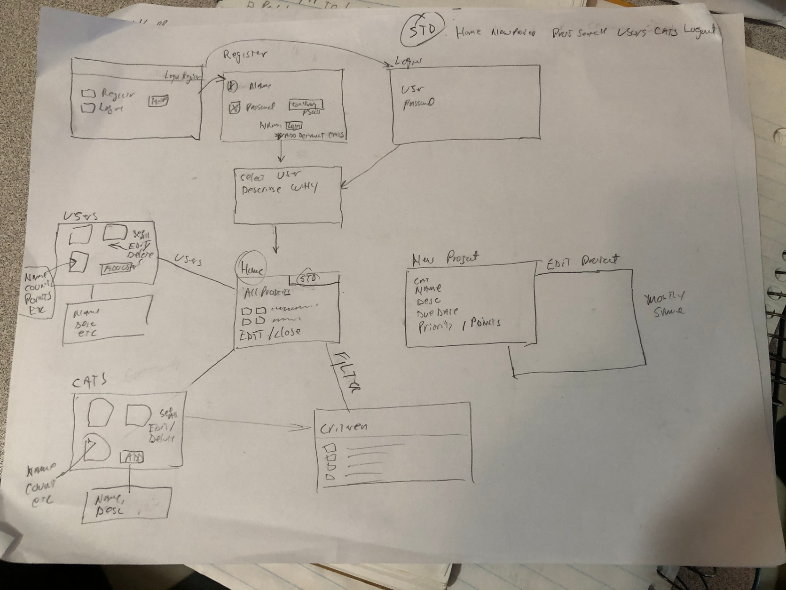
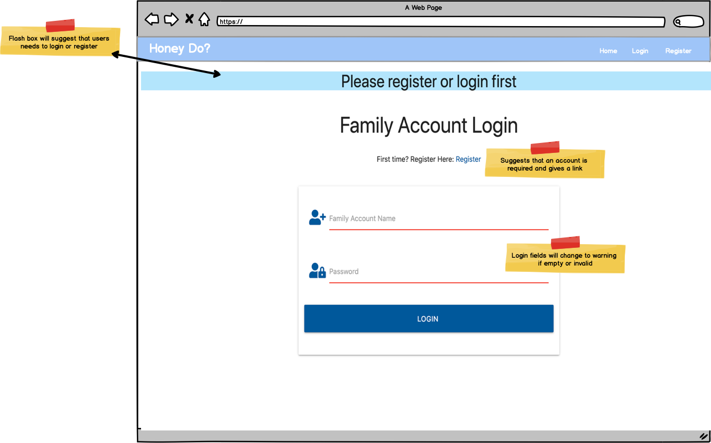
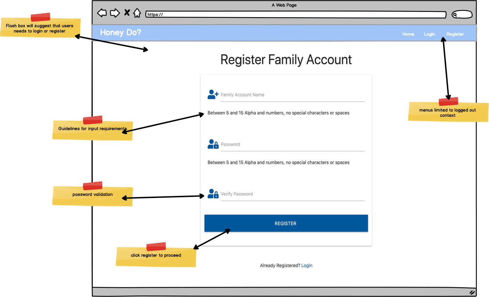
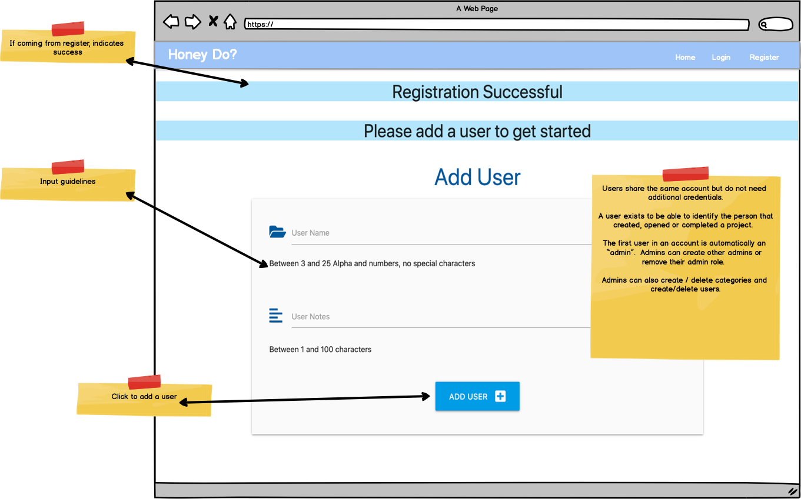
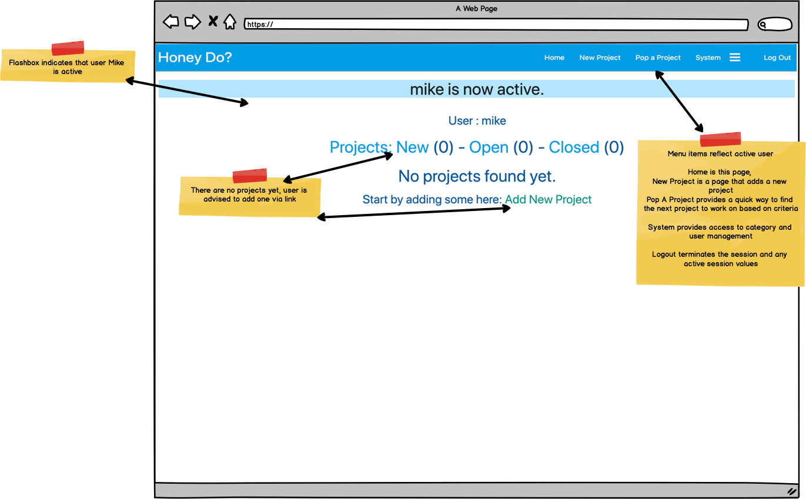
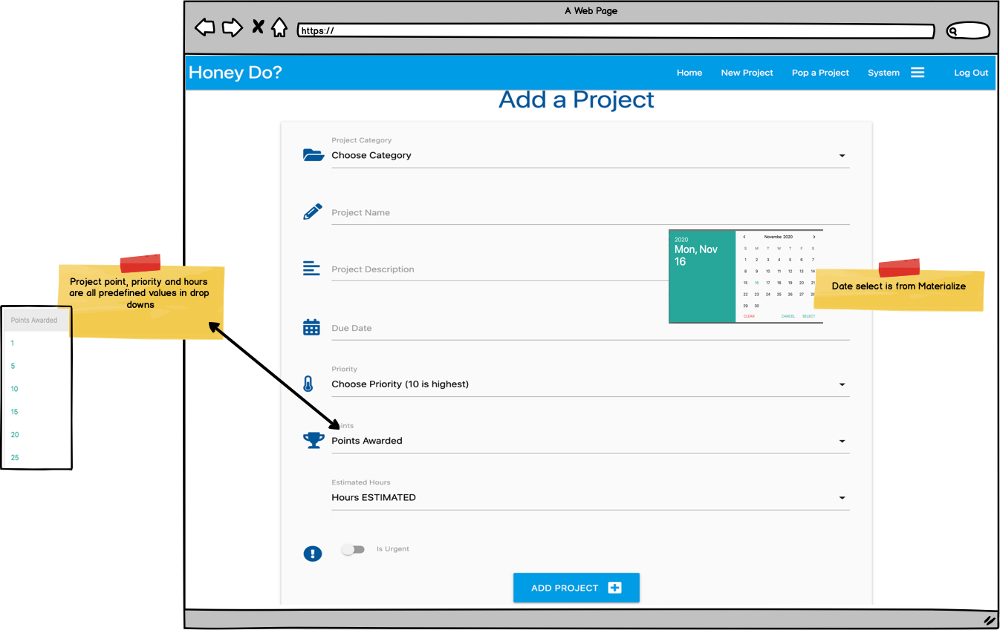
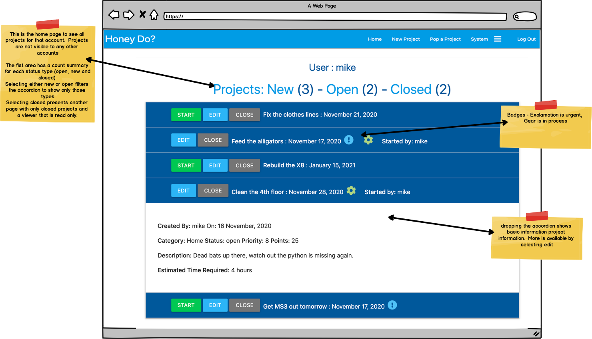
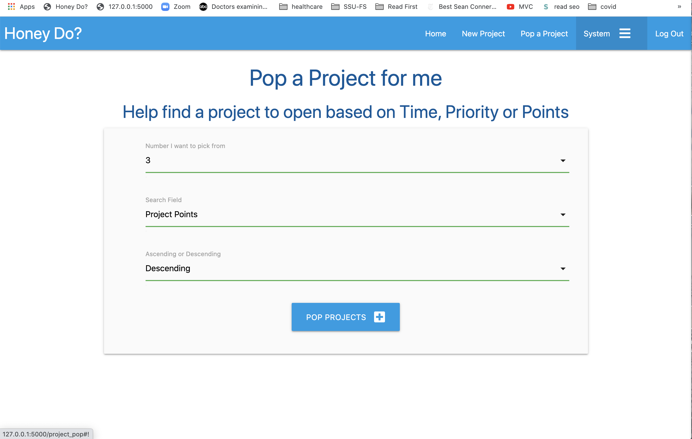
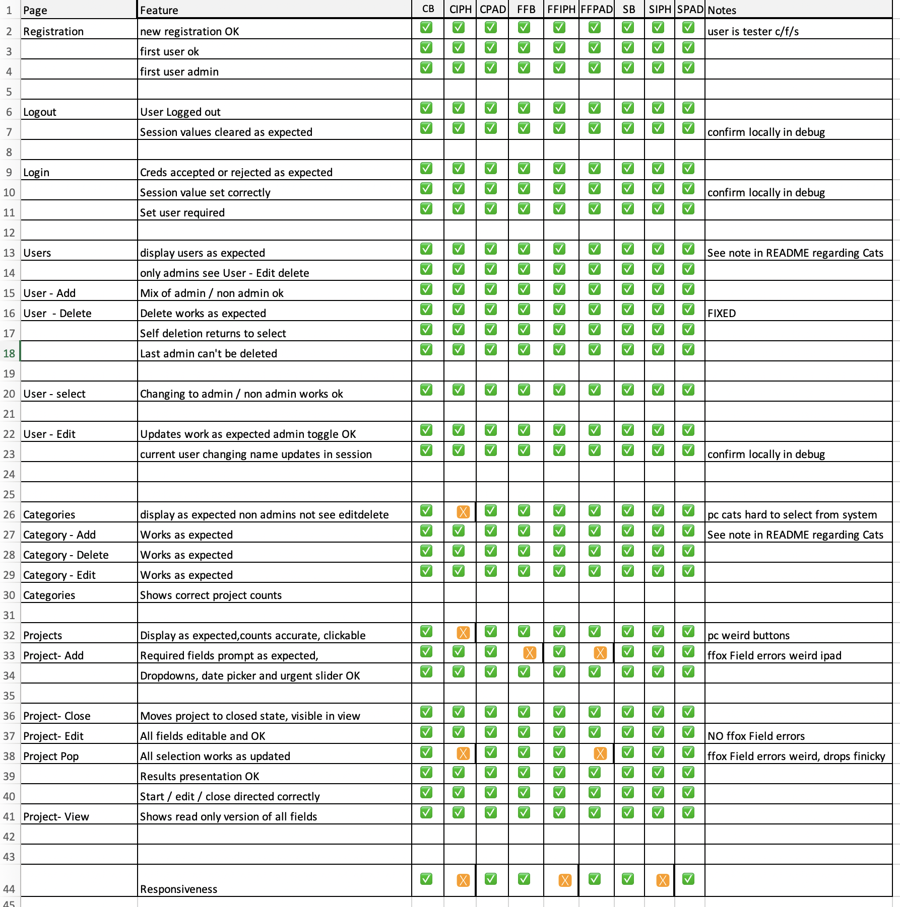

# Mike Magee - Code Institute Milestone 3  Honey-Do app 

The requirement of this project is to "... build a full-stack site that allows your users to manage a common dataset about a particular domain."

Even before the Task Manager mini project was presented, I have wanted to build an electronic "Job Jar" similar to the on in the "Hi and Louis" strip.  We currently have a yellow sticky version of this called the Honey Do wall.

My approach was to provide an intuitive app with a clean presentation. 

The fundamental use case for this first version is: 
    - A family has one "account" with basic name/password validation
    - Within this account there are users eg: Dad, Mom, child1 etc.. 
    - Anyone can create a project, assign goals, priority and "reward points" 
    - Anyone can open, complete and earn the award points. 
    - Categories and users can be added and managed

***
## Table of contents

* [Demo App](#Hosted_app)
* [UX](#ux)
* [User Design](#user)
  * [User Goals](#User_goals)
  * [User Stories](#User_Stories)
  * [Wireframes](#Wireframes)
* [Features](#features)
  * [Frontend features](#frontend_features)
  * [Backend features](#backend_features)
  * [Deferred features](#Deferred_features)

* [User stories](#User_Stories)
* [Technologies used](#Technologies_Used)
* [Development environment](#Development_environment)
* [Lessons Learned](#Lessons_learned )

* [Testing](#Testing)
* [Validation](#Validation)

* [Heroku Deployment](#Heroku_deployment)
* [Local deployment](#Local_deployment)

* [Credits](#credits)
  * [Content](#content)
  * [Acknowledgements](#acknowledgements)

## Hosted_app
The App is published at https://magee-ms3.herokuapp.com

 

## UX 
***
The majority of responsiveness is supplied by Materialize.  
I tried to focus on the database side of it

## User 
### User_goals 
* An app that is simple to approach and use. 
* Controls and interactions that are familiar and predictable.
* Responsive across device types.
* Somewhat fun. 
* Useful for managing family projects among members

### User_Stories 
* As a user I expect the app to be usable without instruction if possible
* As a user I expect adding a new project to be simple and fast
* As a user I expect accessing, opening and closing projects to be simple
* As a user I expect searching for projects via various criteria to be intuitive
* As a user I want to be able to observe how many projects are in what state. 
* As a user I want to be know how many projects are in each category
* As a user I want to award points for projects  and collect points for completing projects 
* As a user I want to be able to have the App "Pop" a project off based on criteria.  I use the term "Pop" to provide a way to get a single or short list of projects based on a selected criteria (priority, points or duration).  For those folks that want to be surprised at which project is next.

## Wireframes
Wireframes for usability on Desktop 
Note that because this project was focused on database and CRUD I did not do the wireframes up front.  I worked from limited hand drawings as I learned what Materialize would provide.   These wireframe images are produced RETROACTIVELY and only for the desktop.  I relied on Materialize for the responsiveness. 

***
Initial Idea

***
Application Entry Point

***
Initial Registration

***
Adding a User

***
Homepage with no projects yet

***
Project Creation

***
Basic desktop

***
Read only view for closed projects

***
Project Pop Results

***
Read only view for closed projects

## Features

### Frontend_features

* a simple application that needs almost no instruction 
* an "account" with name and password.  
* multiple users (mom, dad, cat, etc.) that create and complete projects 
* ability to "Pop" the next project you will start based on some limited search criteria
* add, update and delete users and project categories
* seeing counts of projects in various states
* seeing counts of projects by category

### Backend_features

* constant Flask session settings for Account, user and admin status.  This provides the ability for multiple accounts within the database.
* No visibility to projects, users or categories for different accounts. 
* Some, but limited error handling
* updating of selected fields in each collection

### Deferred_features

* More defensive code to protect from folks augmenting the UI
* A well thought out approach to editing and renaming users and categories.  I'm very concerned with the simple approach here.
  - I've restricted edits/deletes to admin bit it's too open due to time constraints.  Three approaches come to mind. 
    - Cascading updates for editing and deleting Categories and users
    - Restricting editing or deleting Categories and users that have active projects
    - Complex embedding of category and user id's (like a foreign key in RDBMS).  Yuk 
* MUCH stronger error handling for MongoDB and Python errors.  
  
*** 

  *** 

## Lessons_learned 
- ** Python coding **: I didn't lint it until the end.  I learned that I should lint before EVERY checkin. 
- ** Jinja HTML Validation **: A combination of copying the resolved HTML from the browser as well as using the source HTML provided the best results. 
- There's a lot to Mongo that I don't know. 
  

***
## Technologies_Used

In this section, you should mention all of the languages, frameworks, libraries, and any other tools that you have used to construct this project. For each, provide its name, a link to its official site and a short sentence of why it was used.

- JQuery to simplify DOM manipulation.
    - https://jquery.com)
- HTML Validation by freeformatter 
    - https://www.freeformatter.com/html-validator.html
- CSS Validation by W3C
    - https://jigsaw.w3.org/css-validator/
- Python Lint
    - http://pep8online.com/
- Development framework Visual Studio Code (mac) by Microsoft v1.50.1
    -https://visualstudio.microsoft.com/vs/mac/
- Python 
    - https://https://www.python.org/
- Github - Source Code Control 
    - https://https://github.com/
    - Github integration to Heroku: https://devcenter.heroku.com/articles/github-integration
- Heroku - Platform as a service (PaaS) for cloud deployment of app 
    - https://www.heroku.com
- Mongo - NoSQL database 
    - MongoDB shell version v4.4.0
    - MongoDB server version: 4.2.10
- Materialize V1.0.0  - UI component library 
    - https://materializecss.com/
- Font Awesome - Fonts and Icons 
    - https://fontawesome.com/
- BCRYPT - password hashing 
    - https://pypi.org/project/bcrypt/
******

### Development_environment 
- Code Institute student template for Gitpod was used
- Locally, Visual Studio Code, periodically pushing to Github
MIKE DESCRIBE

## Testing 
There should be no visible difference in behavior between browsers.  I have tested with:  
- Chrome Version 86.0.4240.198 
- Firefox Version 75.0 (64-bit)
- Safari Version  13.1.2 (15609.3.5.1.3)

All tests described below have worked successfully across all browsers.
Responsiveness checks have been run by using the Chrome developers's tools as well as manually resizing the windows  

In general everything "worked".  I did however feel the need to set the tests in orange for some test below.

In terms of responsiveness,
    - Firefox had an odd behavior with field validation showing red when it should have been green. 
    - The action buttons on the project summary just looked bad on the iPhone.  I could not get around that.
    - Across all browsers, the first and last entries in the dropdowns  were VREY finicky.  
      You had to select them JUST right to avoid triggering whatever was behind them.

-- 

Key to matrix: 
* CB = Chrome Browser, CIPH = Chrome iPhone, CPAD = Chrome iPad			
* FFB = Firefox Browser, FFIPH = Firefox iPhone, FFPAD = Firefox iPad			
* SB = Safari Browser, SIPH = Safari iPhone, SPAD = Safari iPad	
 

## Validation
    HTML Verification
During HTM validation the following errors surfaced that I could not or (for the h2=h6) didn't feel was necessary to address

    Section lacks heading. Consider using “h2”-“h6” elements to add identifying headings to all sections.
     - I assume this is OK for what we are doing here
    
    Attribute “method” not allowed on element “div” at this point.
        From line 41, column 13 to line 41, column 69
        Code Extract:
        
↩
    - I found no way to get around it. 
    
    The “select” element cannot have more than one selected “option” descendant unless the “multiple” attribute is specified.
        From line 99, column 21 to line 99, column 50
        Code Extract:
        <option value="Home" selected>Home<
        This came from a Code Institute example of the Materialize selection. 
    - I found no way to get around it. 

## Deployment
## Heroku_deployment

** MIKE Describe environment variables required to run
    - MS3_ENVIRONMENT
    - MS3_MONGO_DBN
    - MS3_MONGO_URI
    - IP 
    - PORT 
    - SECRET_KEY 

## Heroku_deployment

### Github to Heroku integration
    Described Here: https://devcenter.heroku.com/articles/github-integration
MJM DESCRIBE MANUAL AND AUTO GH->HEROKU Integration here 

## Local_deployment
This sample site can easily edited, debugged and run locally in the VSCode IDE by using the GoLive feature, which is how this code was developed.  To do this:
- From a terminal in the appropriate location clone a copy of the code locally: 
    - run: `git clone https://github.com/michaelmagee/magee-MS3.git`
    - then run `git remote rm origin` to remove the remote references to github.
- Then from VSCode, open a new window and open the newly cloned directory.   The Go Live button is on the bottom right.
### Gitpod Reminders

To run a frontend (HTML, CSS, Javascript only) application in Gitpod, in the terminal, type:

`git pull`   To be sure that the code is current
`python3 -m http.server`  

A blue button should appear to click: *Make Public*,

Another blue button should appear to click: *Open Browser*.

## Credits
- Organizational and planning support from Mentor Brian M.  
- Attempted color inspiration from color.adobe.com
- Secret Key generation from: https://randomkeygen.com/  as suggested by CI
- Using BCRYPT for hashing by Brian my mentor. 
- Excellent examples provided by Code Institute for the Task Manager.

### Media & Content
-  Icons by - https://fontawesome.com/

### Acknowledgements

- I received inspiration for this project from examples from Code Institute that I played with as I was learning.  

